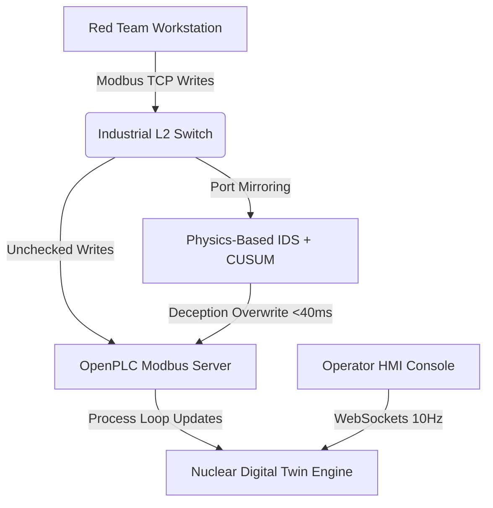

# Argus: Process-Aware OT Deception & Digital Twin Cyber Range

Argus is an educational cybersecurity demonstration platform designed to visually explain how industrial cyber attacks propagate through an OT network and interact with a physical process.

---

## System Architecture



---

## Quickstart: How to Run the Project

### Phase 1: Spin up the Modbus PLC Emulator (Docker)
1. Ensure Docker Desktop is running.
2. Navigate to the backend directory:
   ```pwsh
   cd A:\Project-IX\Argus\backend
   ```
3. Boot the OpenPLC Modbus server container:
   ```pwsh
   docker-compose up -d
   ```
   *Note: OpenPLC will bind to port `502` on subnet `172.18.0.5`.*

### Phase 2: Start the FastAPI Cyber-Physical Backend
1. Ensure python dependencies are installed:
   ```pwsh
   cd A:\Project-IX\Argus\backend
   pip install -r requirements.txt
   ```
2. Run the FastAPI development server:
   ```pwsh
   python -m uvicorn app.main:app --host 0.0.0.0 --port 8000 --reload
   ```
   *This starts the 10Hz physics loop, CUSUM anomaly detector, and exposes the REST + WebSocket endpoints.*

### Phase 3: Start the Operator Workstation HMI (Frontend)
1. Navigate to the frontend directory:
   ```pwsh
   cd A:\Project-IX\Argus\frontend
   ```
2. Start the Vite hot-reloading development server:
   ```pwsh
   npm run dev
   ```
3. Open your browser and navigate to the local address:
   [http://localhost:5173](http://localhost:5173)

---

## Pre-Configured Test Credentials

Authenticate using one of the following Operator accounts to test JWT and Role-Based Access Control (RBAC):

| Username | Password | Role | Permissions |
| :--- | :--- | :--- | :--- |
| `admin` | `adminpassword` | `ADMINISTRATOR` | Full plant controls, setpoints modification, SCRAM, and RBAC view. |
| `operator` | `operatorpassword` | `OPERATOR` | Plant control, setpoint adjustments, SCRAM. |
| `auditor` | `auditorpassword` | `AUDITOR` | Read-only access. Write attempts trigger critical alarm **ALM-007**. |
